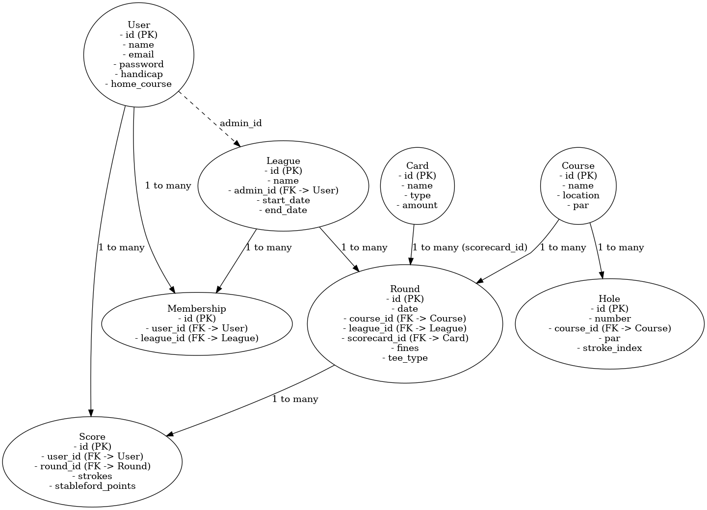

# Golf League
### An evolving application that aims to remove the need for manual calculation and circulation of my weekend golf league, as well as allow me to test out some new technologies I am passionate about learning!

### Tech Stack 
- Frontend: React Native (deployed to relavant stores)
- Backend API: Node.js with Express.js (intial deployment to Railway for testing, eventually Amazon EC2 for more control)
  - **My Routes** only map endpoints to controller functions
  - **My Controllers** handle req/res and talk to services
  - **My Services** hold business logic (validation, transformations)
  - **My Repositories** talk to the database
  
  - Core API Resources will need the following RESTful Endpoints
    - Users
    - Leagues
    - Memberships
    - Courses / Holes
    - Rounds / Scores
    - Cards (fines/rewards)
  - JWT-based Authentication
  
- Database: MySQL (deployed to Amazon RDS)

- Authentication & Authorization
  - JWT + Refresh Tokens
  - Social login (Google, Apple) via Expo or Firebase Auth (done firebase before, but will try Expo if time)
  - Role-based access control for admins vs players
- Notifications & Scheduling
  - Expo Push Notifications or Firebase Cloud Messaging
  - Backend cron jobs for reminders (node-cron)
- Testing & CI/CD
  - Jest, React Native Testing Library
  - GitHub Actions for automated tests and builds
- Developer Experience (DX)
  - TypeScript for full-stack typing
  - Postman to test API
  - ESLint, Prettier for consistent code quality

### Design Inspiration

- [Login](https://dribbble.com/shots/10547150-Login-Flow-Kaya-Wallet-Apps)
- [Leaderboard](https://dribbble.com/shots/16697274-Smartdeck-Leaderboard)
- [Create](https://dribbble.com/shots/8758670-Pill-Reminder-Medication-Tracking-App)
- [Profile](https://dribbble.com/shots/21177181-FitFe-Profile-Workout-Plan)